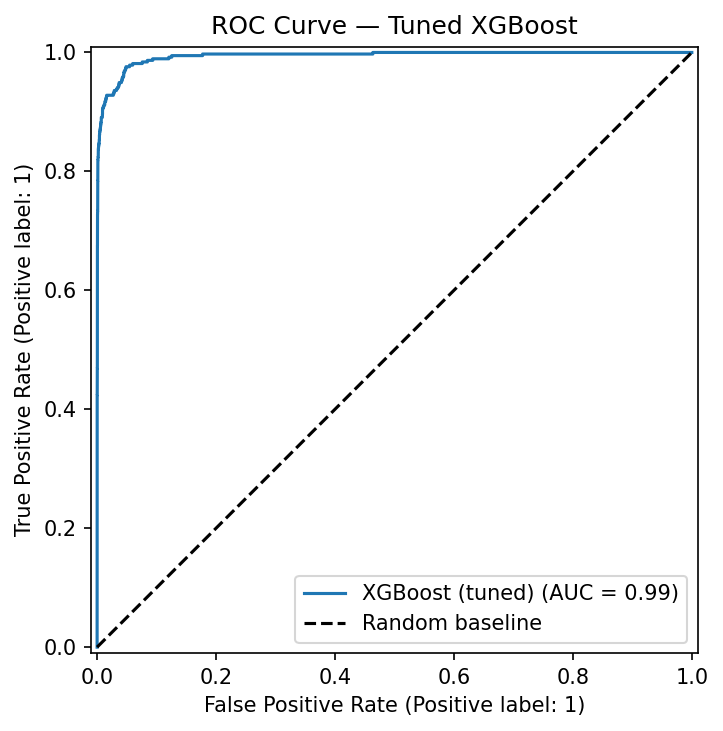
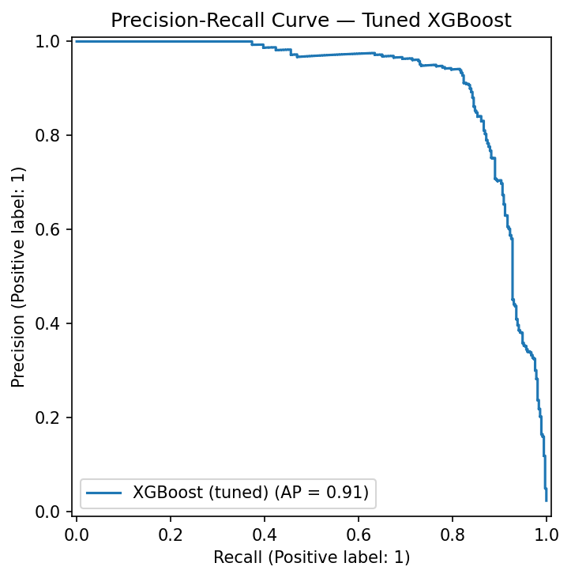
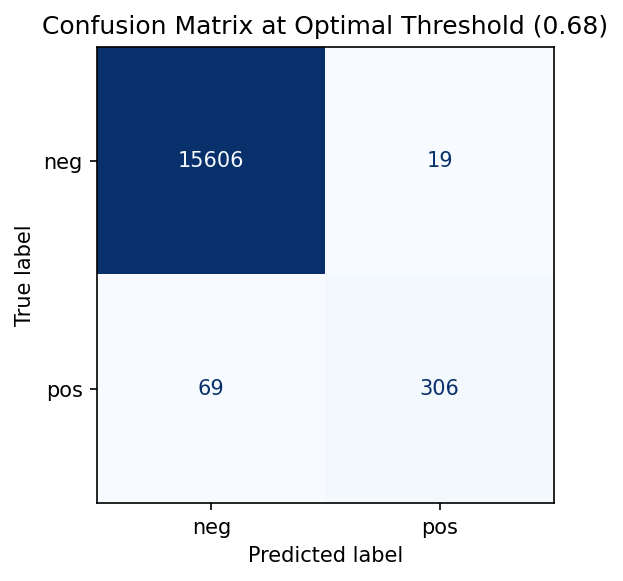
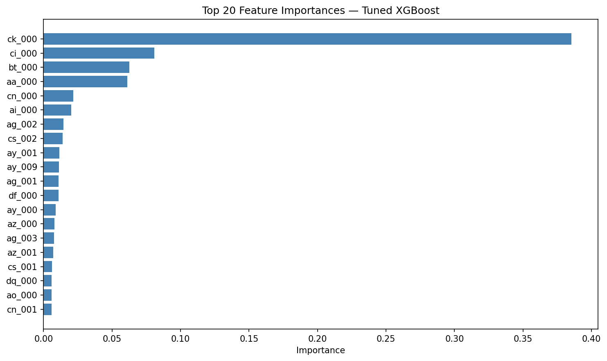

# Vehicle Predictive Maintenance

An end-to-end machine learning project that predicts Air Pressure System (APS) failures in heavy vehicles using the Scania APS dataset.

**Live demo:** https://vehicle-predictive-maintenance.onrender.com

---

## Problem Statement

APS (Air Pressure System) failures are a leading cause of truck breakdowns. Early detection reduces maintenance costs and prevents road incidents. This project builds a binary classifier that flags vehicles at risk of APS failure from sensor readings.

The core ML challenge is severe class imbalance — only 1.67% of samples are positive (failure). A naive model predicting "no failure" every time achieves 98.3% accuracy while being completely useless.

---

## Dataset

- **Source:** [Scania APS Failure Dataset — UCI ML Repository](https://archive.ics.uci.edu/dataset/421/aps+failure+at+scania+trucks)
- **Train set:** 60,000 samples
- **Test set:** 16,000 samples
- **Features:** 170 anonymized sensor readings
- **Class balance:** 98.33% negative / 1.67% positive

---

## Project Structure
```
vehicle-predictive-maintenance/
│
├── data/
│   ├── raw/               # Original dataset (not tracked by git)
│   └── processed/         # Cleaned, transformed data
│
├── notebooks/
│   └── 01_eda.ipynb       # Exploratory data analysis
│
├── src/
│   ├── data/
│   │   └── preprocess.py  # Full preprocessing pipeline
│   ├── models/
│   │   ├── train.py       # Train LR, RF, XGBoost baselines
│   │   ├── tune.py        # RandomizedSearchCV on XGBoost
│   │   ├── threshold.py   # Optimal decision threshold search
│   │   ├── evaluate.py    # ROC, PR curves, feature importance
│   │   └── predict.py     # Inference on new data
│
├── app/
│   ├── main.py            # FastAPI app
│   └── static/
│       └── index.html     # Frontend UI
│
├── models/                # Saved model artifacts
├── reports/               # Evaluation plots and metrics
├── config.yaml            # Centralized configuration
└── requirements.txt
```

---

## ML Pipeline

### 1. Preprocessing
- Drop columns with >70% missing values (7 columns removed)
- Median imputation on remaining missing values
- Target encoding: `pos` → 1, `neg` → 0
- StandardScaler normalization
- All transformations fit on train, applied to both train and test

### 2. Handling Class Imbalance
- Applied SMOTE (Synthetic Minority Oversampling Technique) on training data only
- Balanced training set: 59,000 vs 59,000
- Evaluation metrics: ROC-AUC, Average Precision, F1 — never accuracy

### 3. Model Comparison

| Model | ROC-AUC | Avg Precision | F1 (pos) |
|---|---|---|---|
| Logistic Regression | 0.979 | 0.806 | 0.63 |
| Random Forest | 0.995 | 0.880 | 0.81 |
| XGBoost | 0.993 | 0.913 | 0.84 |

### 4. Hyperparameter Tuning
- RandomizedSearchCV on XGBoost with 30 iterations, 5-fold CV
- Optimized for F1 on positive class
- Best parameters: `n_estimators=500, max_depth=4, learning_rate=0.2, subsample=0.9`

### 5. Threshold Optimization
- Default threshold (0.5) replaced with optimal threshold (0.68)
- Maximizes F1 on positive class on held-out test set

### 6. Final Model Performance

| Metric | Score |
|---|---|
| ROC-AUC | 0.994 |
| Average Precision | 0.912 |
| Precision (pos) | 0.94 |
| Recall (pos) | 0.82 |
| F1 (pos) | 0.87 |

---

## Evaluation Plots

| ROC Curve | Precision-Recall Curve |
|---|---|
|  |  |

| Confusion Matrix | Feature Importance |
|---|---|
|  |  |

---

## Web Application

Built with FastAPI and vanilla JS. Users upload a CSV file of sensor readings and get back failure predictions with probability scores.

- `GET /health` — model status and configuration
- `POST /predict` — accepts CSV file, returns predictions

---

## Setup
```bash
git clone https://github.com/Metehan02/vehicle-predictive-maintenance.git
cd vehicle-predictive-maintenance

python -m venv venv
.\venv\Scripts\Activate  # Windows
pip install -r requirements.txt
```

Download the dataset from [UCI ML Repository](https://archive.ics.uci.edu/dataset/421/aps+failure+at+scania+trucks) and place both CSV files in `data/raw/`.
```bash
python src/data/preprocess.py
python src/models/train.py
python src/models/tune.py
python src/models/threshold.py
python src/models/evaluate.py
uvicorn app.main:app --reload
```

---

## Tech Stack

- **Python 3.11**
- **scikit-learn** — preprocessing, evaluation, cross-validation
- **XGBoost** — final model
- **imbalanced-learn** — SMOTE
- **FastAPI** — REST API
- **Uvicorn** — ASGI server
- **Render** — deployment